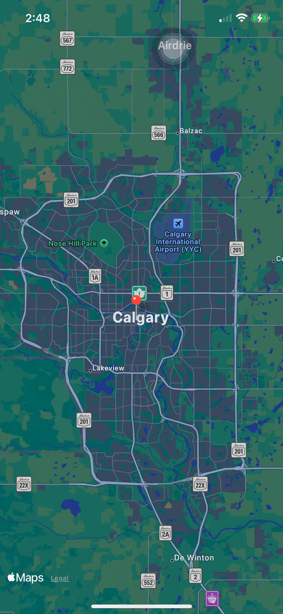
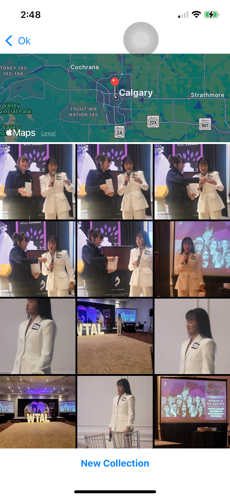

# Virtual Tourist
Virtual Tourist is one of the Udacity's iOS nano-degree projects that is based on networking, persistence and other iOS frameworks.

## Description

This app allows users specify travel locations around the world by dropping pins on the map for the choosen location. A virtual photo albums is created for each location and stroed using `CoreData`

  
   
  

## Focus
1. Making Network Request (Get, Post ,Put ,Delete)
2. Using a web servers
3. Parsing JSON file using Codable (Decodable , Encodable)
4. Asynchronous Requests
5. Authentication Requests
6. MVC Pattern with Network (Create Cleaner Code) GCD and Queues
7. Persisting app state and user data using `UserDefualt` and `CoreData`

## Todo

## Requirements
XCode >= 10.3
